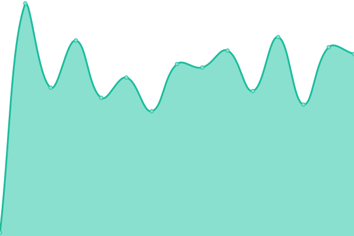
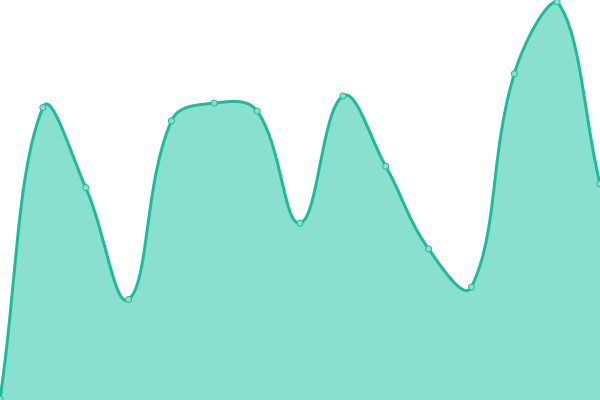

# [📈 Live Status](https://uptime.uselest.com): <!--live status--> **🟨 Degraded performance**

This repository contains the open-source uptime monitor and status page for [Stellar Tech](https://uptime.uselest.com), powered by [Upptime](https://github.com/upptime/upptime).

With [Upptime](https://upptime.js.org), you can get your own unlimited and free uptime monitor and status page, powered entirely by a GitHub repository. We use [Issues](https://github.com/StellarTechLab/uptime/issues) as incident reports, [Actions](https://github.com/StellarTechLab/uptime/actions) as uptime monitors, and [Pages](https://uptime.uselest.com) for the status page.

<!--start: status pages-->
<!-- This summary is generated by Upptime (https://github.com/upptime/upptime) -->
<!-- Do not edit this manually, your changes will be overwritten -->
<!-- prettier-ignore -->
| URL | Status | History | Response Time | Uptime |
| --- | ------ | ------- | ------------- | ------ |
|  [Mindscape Prod](https://web.mindscapeapp.io) | 🟨 Degraded | [mindscape-prod.yml](https://github.com/StellarTechLab/uptime/commits/HEAD/history/mindscape-prod.yml) | 

 136ms
     
 | 

<a href="https://uptime.uselest.com/history/mindscape-prod">99.68%</a>
    

|  [Mindscape Stage](https://web.stg.mindscapeapp.io) | 🟩 Up | [mindscape-stage.yml](https://github.com/StellarTechLab/uptime/commits/HEAD/history/mindscape-stage.yml) | 

 188ms
     
 | 

<a href="https://uptime.uselest.com/history/mindscape-stage">99.89%</a>
    

|  API-BE Stage | 🟩 Up | [api-be-stage.yml](https://github.com/StellarTechLab/uptime/commits/HEAD/history/api-be-stage.yml) | 

 2832ms
     
 | 

<a href="https://uptime.uselest.com/history/api-be-stage">100.00%</a>
    

|  API-BE Prod | 🟩 Up | [api-be-prod.yml](https://github.com/StellarTechLab/uptime/commits/HEAD/history/api-be-prod.yml) | 

 158ms
     
 | 

<a href="https://uptime.uselest.com/history/api-be-prod">0.00%</a>
    

<!--end: status pages-->

[**Visit our status website →**](https://uptime.uselest.com)

## 📄 License

- Powered by: [Upptime](https://github.com/upptime/upptime)
- Code: [MIT](./LICENSE) © [Anand Chowdhary](https://anandchowdhary.com), supported by [Pabio](https://pabio.com)
- Data in the `./history` directory: [Open Database License](https://opendatacommons.org/licenses/odbl/1-0/)
